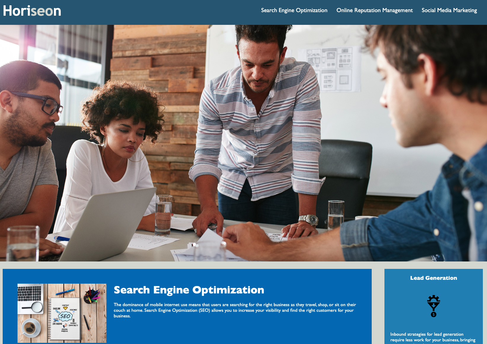
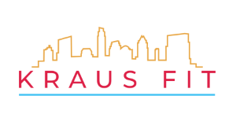

# Professional-Portfolio
A professional portfolio of work.

## Description

This is a professional portfolio landing page created for and by Chadwick Kraus. This webpage displays an About section, Portfolio section, and a section about Chadwick's personal business, Kraus Fit. This webpage contains HTML semantics and a corresponding CSS stylesheet. Semantic tags have been included to improve SEO visibility and accessbility features.

[Deployed App]

## Installation

No installation necessary for this application.

## Usage

This webpage highlights a short biography, a portfolio section, and professional accomplishments of Chadwick Kraus.

## Credits

[HTML Semantic Elements](https://www.w3schools.com/html/html5_semantic_elements.asp)

[CSS Selector](https://developer.mozilla.org/en-US/docs/Glossary/CSS_Selector)

[CSS Layout - The Position Property](https://www.w3schools.com/css/css_positioning.asp)

[Professional README Guide](https://coding-boot-camp.github.io/full-stack/github/professional-readme-guide)

[CSS: Cascading Style Sheets](https://developer.mozilla.org/en-US/docs/Web/CSS)

[CSS Transition](https://developer.mozilla.org/en-US/docs/Web/CSS/transition)

[Basic Concepts of Flexbox](https://developer.mozilla.org/en-US/docs/Web/CSS/CSS_Flexible_Box_Layout/Basic_Concepts_of_Flexbox)

[CSS Image Styling](https://www.w3schools.com/css/css3_images.asp)

[Font Awesome](https://fontawesome.com/)

## License

No license assigned.